  

  
  &nbsp;
  
  &nbsp;
  

 

  <h3>Architecting robust backend systems and building seamless full-stack experiences.</h3>
  
Computer Science student passionate about <b>Learning new things </b>.

 

## 🚀 Currently Building

**TheraMotion** — An innovative stroke rehabilitation application developed for my undergraduate thesis. 
* **The Stack:** React Native & Expo (Frontend), FastAPI & PostgreSQL (Backend).
* **The Magic:** Features a real-time pose-estimation pipeline that evaluates and scores exercise form on the fly to aid in physical therapy.

*Always open to collaborating on impactful web and mobile projects!*

 

## 💻 Tech Stack

### 🎨 Frontend & Mobile
<table align="center">
  <tr>
    <td align="center" width="90">  HTML5</td>
    <td align="center" width="90">  CSS3</td>
    <td align="center" width="90">  React</td>
    <td align="center" width="90">  Expo</td>
    <td align="center" width="90">  Flutter</td>
    <td align="center" width="90">  Tailwind</td>
  </tr>
</table>

### ⚙️ Backend & API
<table align="center">
  <tr>
    <td align="center" width="90">  Node.js</td>
    <td align="center" width="90">  Express</td>
    <td align="center" width="90">  Flask</td>
  </tr>
</table>

### 🗄️ Databases
<table align="center">
  <tr>
    <td align="center" width="90">  PostgreSQL</td>
    <td align="center" width="90">  MongoDB</td>
  </tr>
</table>

### 🛠️ Languages & Tools
<table align="center">
  <tr>
    <td align="center" width="90">  TypeScript</td>
    <td align="center" width="90">  JavaScript</td>
    <td align="center" width="90">  Git</td>
  </tr>
</table>

 

## 📊 Analytics & Streak

  
  

  

